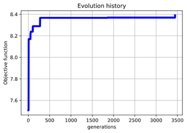
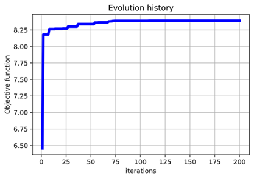
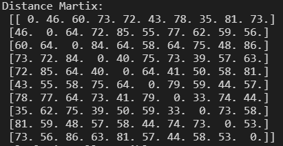
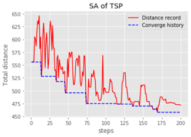

## Python實作手刻 Metaheuristic 演算法

三種不同的演算法:

+ [基因演算法](./GA.ipynb "GA") (Genetic Algorithms, GA)
+ [粒子群演算法](./PSO.ipynb "PSO") (Particle Swarm Optimization, PSO)
+ [模擬退火](./SA.ipynb "SA") (Simulated Annealing, SA)

### GA、PSO:

目標函數均為雙變數函數:
```py
def ObjectiveFF(x,y):
    ff = math.exp(-0.1*(x**4 + y**4)) + math.exp(math.cos(2*math.pi*x) +math.cos(2*math.pi*y))
    return ff
```
其中變數限制為: `-1≤x≤1` `-2≤y≤1` `x+y≤1`

在限制內找到目標函數最小值 `8.3891`,`(x,y)=(0,0)`

#### Result:

+ GA:



+ PSO:



### SA:
目標函數為經典的旅行業務員問題(Traveling Salesman Problem, TSP)，總共10個點，最佳化旅行路徑來最小化總距離(包含回到起始點)。

隨機初始化Distance Matrix，距離範圍為均勻隨機變數20-90，產生一對稱矩陣，Martix(a,b)表示為從a點到b點的距離。

```py
D = np.random.randint(20,90+1, size=(10,10))
idx = [i for i in range(len(D))]
D[idx,idx] = 0
D = np.ceil((D + D.T)/2)
print('Distance Martix:\n',D)
```

#### Result:



